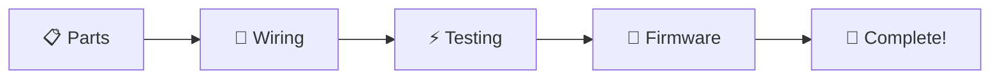

# 🐭 RattusBoard

<div align="center">

*A premium VIAL-powered split ergonomic keyboard with integrated trackball and encoder*

[](https://qmk.fm/)
[](https://get.vial.today/)
[](LICENSE)
[](https://github.com/Rattus-ukrizovany/RattusBoard/actions)

</div>

---

## 🚀 Quick Start

<table>
<tr>
<td width="33%">

### 👤 **New Users**
Just want to build and use?
- 📥 **[Download Latest Firmware](https://github.com/Rattus-ukrizovany/RattusBoard/releases/latest/download/rattusboard_default.uf2)**
- 🔧 **[Flash Instructions](#-firmware-flashing--split-setup)**
- 🏗️ **[Build Guide](HALVES_WIRING.md)**

</td>
<td width="33%">

### ⚙️ **Customizers**
Want to modify layouts?
- 🎹 **[Vial App](https://get.vial.today/)** (Live editing)
- 📝 **[Default Keymap](keyboards/rattusboard/keymaps/default/keymap.c)**
- 🔑 **[Layer Documentation](#-keymap--layers)**

</td>
<td width="33%">

### 🧑‍💻 **Developers**
Building from source?
- ⚡ **[QMK Setup Guide](QMK_SETUP.md)**
- 🔧 **[Config Files](keyboards/rattusboard/)**
- 🐞 **[Troubleshooting](#-troubleshooting-reference)**

</td>
</tr>
</table>

### 📚 **Essential Links**
- 🔌 **[Wiring & Pinout Guide](HALVES_WIRING.md)** — Complete build instructions with diagrams
- 💬 **[Get Help](https://github.com/Rattus-ukrizovany/RattusBoard/issues/new/choose)** — Report bugs, ask questions, request features

---

## 🌟 Overview

<div align="center">

**RattusBoard** is a cutting-edge split ergonomic keyboard designed for productivity enthusiasts and professionals who demand precision, comfort, and customization.

*Built on the robust QMK firmware for the RP2040 platform, featuring integrated trackball, rotary encoder, and real-time keymap editing via Vial.*

</div>

### ✨ Key Features

<table>
<tr>
<td width="50%">

#### 🎯 **Hardware**
- 🖱️ **PMW3360 Trackball** — Precision cursor control
- 🔄 **Rotary Encoder** — Smooth, customizable input  
- ⌨️ **Split Design** — Based on Corne layout
- 🔌 **USB-C** — Raspberry Pi Pico (RP2040)
- 🔗 **TRRS Connection** — Between halves

</td>
<td width="50%">

#### ⚡ **Software**
- 🎹 **Vial Support** — Real-time editing (no reflashing!)
- 📱 **QMK Firmware** — Layers, macros, advanced features
- 🔧 **Auto Hand Detection** — Single firmware for both halves
- 🌐 **Open Source** — GPL v3, fully customizable

</td>
</tr>
</table>

---

## 📋 Hardware Specifications

<table>
<tr>
<td width="50%">

### 🖥️ **Controller & Matrix**
- **MCU:** Raspberry Pi Pico (RP2040)
- **Layout:** Split 3×6 + 3 thumbs (42 keys total)
- **Matrix:** 4×6 per half (unified pin mapping)
- **Diode Direction:** COL2ROW
- **Debounce:** 5ms

### 🔌 **Pin Configuration**
- **Matrix Rows:** GP2, GP3, GP4, GP5
- **Matrix Cols:** GP15, GP16, GP17, GP18, GP19, GP20
- **Split Serial:** GP1 (TRRS communication)
- **Hand Detection:** GP21 (GND=Left, Float=Right)

</td>
<td width="50%">

### 🖱️ **Peripherals (Right Half)**
- **Trackball:** PMW3360 sensor @ 1600 CPI
- **SPI Pins:** CS=GP22, SCK=GP23, MOSI=GP24, MISO=GP25
- **Encoder:** GP26 (A), GP27 (B), 4 detents/rotation

### ⚡ **Features**
- **Bootmagic:** Enabled
- **NKRO:** Full N-key rollover
- **Mouse Keys:** Enabled
- **Pointing Device:** PMW3360 driver
- **Dynamic Layers:** 8 layers supported
- **Vial UID:** `{0x12, 0x34, 0x56, 0x78, 0x90, 0x12, 0x34, 0xEF}`

</td>
</tr>
</table>

> 📖 **For detailed pin assignments and wiring diagrams, see [HALVES_WIRING.md](HALVES_WIRING.md)**

---

## 🛠️ Build Guide

<div align="center">

### 📝 **Build Process Overview**

</div>



<table>
<tr>
<td width="50%">

### 🔧 **Required Skills**
- ✅ Basic soldering (THT components)
- ✅ Wire management
- ✅ Following wiring diagrams
- ✅ Basic troubleshooting

### 📦 **Required Components**
- 2× Raspberry Pi Pico
- 2× Sets of switches & keycaps  
- 1× PMW3360 trackball module
- 1× Rotary encoder
- Various resistors, diodes, wiring

</td>
<td width="50%">

### 📚 **Build Resources**
- 🔌 **[Complete Wiring Guide](HALVES_WIRING.md)**
- 📊 **[Pin Assignment Table](HALVES_WIRING.md#-pin-assignment-summary)**
- 🔍 **[Assembly Tips](HALVES_WIRING.md#️-best-practices--tips)**
- 🐞 **[Hardware Troubleshooting](HALVES_WIRING.md#-troubleshooting)**

### ⏱️ **Build Time**
- **Beginner:** 6-8 hours
- **Experienced:** 3-4 hours

</td>
</tr>
</table>

> 💡 **Pro Tip:** Each half uses independent matrix wiring with GP21 pin for automatic hand detection. No need for separate left/right firmware!

---

## 🚀 Firmware Flashing & Split Setup

<div align="center">

### 🎯 **Key Point: One Firmware File for Both Halves!**

**No need for separate left/right firmware files — RattusBoard uses automatic hand detection.**

</div>

### ⚡ **Quick Flash Guide**

<table>
<tr>
<td width="50%">

#### 📥 **Step 1: Download**
1. Go to **[Latest Release](https://github.com/Rattus-ukrizovany/RattusBoard/releases/latest)**
2. Download **`rattusboard_default.uf2`**

#### 🔧 **Step 2: Flash Both Halves**
1. Hold **BOOTSEL** + plug USB (Pico enters bootloader)
2. Drag **`rattusboard_default.uf2`** to **RPI-RP2** drive
3. Repeat for **both Picos** with the **same file**

</td>
<td width="50%">

#### 🔗 **Step 3: Connect & Test**
1. Connect halves with **TRRS cable**
2. Plug USB into **left half** (master)
3. Both halves should work automatically ✨

#### 🎹 **Step 4: Customize (Optional)**
- Download **[Vial App](https://get.vial.today/)**
- Live edit keymap without reflashing!

</td>
</tr>
</table>

### 🧠 **How Auto Hand Detection Works**

```
Left Half (Master)          Right Half (Slave)
┌─────────────────┐        ┌─────────────────┐
│ GP21 → GND      │◀─TRRS─▶│ GP21 → Float    │
│ (Detected Left) │        │ (Detected Right)│
│                 │        │                 │
│ • Matrix 4×6    │        │ • Matrix 4×6    │
│ • USB Master    │        │ • Trackball     │
│                 │        │ • Encoder       │
└─────────────────┘        └─────────────────┘
```

> 🔬 **Technical Details:** The firmware reads GP21 on boot. If grounded, it configures as left/master. If floating, it configures as right/slave with trackball/encoder enabled.

### 🛠️ **Advanced Options**

<details>
<summary><strong>🧑‍💻 For Developers: Custom Builds</strong></summary>

- **QMK Build:** See [QMK_SETUP.md](QMK_SETUP.md) for building from source
- **Custom Features:** The single firmware approach works for most users
- **Separate Builds:** Only needed for experimental features

```bash
# Build VIAL firmware (what gets released)
qmk compile -kb rattusboard -km vial
```

</details>

### 🚨 **Troubleshooting Flash Issues**

| **Problem** | **Solution** |
|-------------|--------------|
| Pico not detected | Try different USB cable, ensure BOOTSEL pressed during connection |
| Only one half works | Check TRRS wiring, verify both halves flashed with same firmware |
| No trackball/encoder | Ensure components wired to right half, check SPI connections |
| Keys not working | Test matrix wiring, use [keyboard tester](https://www.keyboardtester.com/) |

---

## 🎹 Keymap & Layers

<div align="center">

### 🗝️ **4-Layer Layout Based on Corne**

*Optimized for productivity with integrated trackball and encoder controls*

</div>

<table>
<tr>
<td width="50%">

### 📋 **Default Layers**
- **Layer 0:** Base QWERTY layout
- **Layer 1:** Numbers & symbols (raise)
- **Layer 2:** Navigation & function keys (lower) 
- **Layer 3:** Media, system, & trackball controls

### 🖱️ **Trackball Integration**
- **Cursor Movement:** Always active on right half
- **Click Actions:** Thumb keys for left/right click
- **Scroll Mode:** Encoder for precise scrolling

</td>
<td width="50%">

### 🎛️ **Live Customization**
- **[Download Vial](https://get.vial.today/)** for real-time editing
- **No Reflashing:** Changes apply instantly
- **8 Layers Available:** Expand beyond defaults

### 📚 **Resources**
- **[Default Keymap Source](keyboards/rattusboard/keymaps/default/keymap.c)**
- **[Vial Keymap Source](keyboards/rattusboard/keymaps/vial/keymap.c)**
- **[Pin Mappings](HALVES_WIRING.md)**

</td>
</tr>
</table>

### 🔧 **Encoder Functions**

| **Layer** | **Encoder Action** | **Description** |
|-----------|-------------------|-----------------|
| **Base** | Volume Up/Down | System volume control |
| **Raise** | Browser Back/Forward | Web navigation |
| **Lower** | Undo/Redo | Text editing shortcuts |
| **Media** | Track Previous/Next | Media player control |

> 💡 **Tip:** The encoder is located on the right half and can be customized per layer using Vial!

---

## 💻 Software Support

<table>
<tr>
<td width="50%">

### 🎹 **Vial Support** *(Recommended)*
- ✅ **Pre-configured** — Works out-of-the-box
- ⚡ **Live Editing** — No reflashing required
- 🎛️ **Full Control** — Layers, macros, rotary encoder
- 📱 **Cross-Platform** — Windows, macOS, Linux

**Get Started:**
1. Download [Vial App](https://get.vial.today/)
2. Connect RattusBoard
3. Start customizing! 🎨

</td>
<td width="50%">

### ⚙️ **QMK Support** *(Advanced)*
- 🔧 **Custom Builds** — Full source code access
- 🧪 **Experimental Features** — Bleeding edge QMK
- 🛠️ **Advanced Config** — Low-level customization

**Quick Build:**
```bash
# Clone VIAL-QMK for compatibility
git clone https://github.com/vial-kb/vial-qmk.git
cd vial-qmk
qmk compile -kb rattusboard -km vial
```

</td>
</tr>
</table>

### 📖 **Documentation Links**
- 📚 **[QMK Documentation](https://docs.qmk.fm/)** — Official QMK guides and reference
- 🎹 **[Vial Documentation](https://get.vial.today/docs/)** — Vial-specific features and setup
- 🔧 **[RattusBoard QMK Setup](QMK_SETUP.md)** — Detailed build instructions

---

## ⚡ Firmware Downloads

<div align="center">

### 📥 **Latest Release**

**[Download rattusboard_default.uf2](https://github.com/Rattus-ukrizovany/RattusBoard/releases/latest/download/rattusboard_default.uf2)**

*VIAL-enabled firmware with all features — works for both halves!*

[](https://github.com/Rattus-ukrizovany/RattusBoard/releases/latest)

</div>

### 📋 **What's Included**

<table>
<tr>
<td width="50%">

#### ✅ **Features**
- 🎹 **Vial Support** — Live keymap editing
- 🖱️ **PMW3360 Trackball** — Right half integration
- 🔄 **Rotary Encoder** — Scroll wheel functionality  
- ⚡ **Auto Hand Detection** — Single file, both halves
- 🔧 **All QMK Features** — NKRO, layers, macros

</td>
<td width="50%">

#### 🔢 **Technical Details**
- **Firmware Version:** Based on VIAL-QMK
- **File Size:** ~500KB typical
- **Compatibility:** RP2040 (Raspberry Pi Pico)
- **Build:** Automated via GitHub Actions
- **Verified:** Tested on real hardware

</td>
</tr>
</table>

### ⚠️ **Important Notes**

> 🎯 **Single Firmware Approach:** Do NOT download separate left/right files for typical use. The unified firmware automatically detects which half it's running on.

> 🔄 **Always Use Latest:** Older releases may have bugs or missing features. Always download from the link above for the best experience.

### 📦 **Alternative Downloads**
- **[All Releases](https://github.com/Rattus-ukrizovany/RattusBoard/releases)** — Previous versions and release notes
- **[Build Artifacts](https://github.com/Rattus-ukrizovany/RattusBoard/actions)** — Development builds (require GitHub login)

---

## 🧪 Troubleshooting Reference

<div align="center">

### 🔍 **Common Issues & Solutions**

*Most problems can be resolved with one of these fixes*

</div>

### 🚨 **Hardware Issues**

<table>
<tr>
<th width="30%">Problem</th>
<th width="70%">Solution</th>
</tr>
<tr>
<td>🔌 <strong>Pico not detected</strong></td>
<td>
• Try a different USB cable (data, not just power)<br>
• Ensure BOOTSEL button is held <em>while</em> plugging in USB<br>
• Check USB port on computer<br>
• Use USB 2.0 port if USB 3.0 causes issues
</td>
</tr>
<tr>
<td>⌨️ <strong>Only one half works</strong></td>
<td>
• Check TRRS cable and 3.5mm jacks<br>
• Verify both halves flashed with <strong>same</strong> firmware file<br>
• Test TRRS cable with multimeter<br>
• Ensure GP1 (serial) and power connections solid
</td>
</tr>
<tr>
<td>🔤 <strong>Keys not registering</strong></td>
<td>
• Check matrix wiring against <a href="HALVES_WIRING.md">pin diagram</a><br>
• Test individual keys with <a href="https://www.keyboardtester.com/">keyboard tester</a><br>
• Verify diode orientation (COL2ROW)<br>
• Check solder joints on switches
</td>
</tr>
<tr>
<td>🖱️ <strong>Trackball/encoder issues</strong></td>
<td>
• Ensure components are on <strong>right half only</strong><br>
• Check SPI wiring: CS=GP22, SCK=GP23, MOSI=GP24, MISO=GP25<br>
• Clean trackball sensor with compressed air<br>
• Verify encoder pins: A=GP26, B=GP27
</td>
</tr>
</table>

### 💻 **Software Issues**

<table>
<tr>
<th width="30%">Problem</th>
<th width="70%">Solution</th>
</tr>
<tr>
<td>🎹 <strong>Vial not detecting</strong></td>
<td>
• Ensure you flashed <code>rattusboard_default.uf2</code> (VIAL-enabled)<br>
• Restart Vial application<br>
• Try a different USB port<br>
• Check Windows drivers (may need Zadig)
</td>
</tr>
<tr>
<td>⌨️ <strong>Wrong layout active</strong></td>
<td>
• Press layer switching keys (thumb cluster)<br>
• Check current layer in Vial app<br>
• Reset to defaults in Vial<br>
• Re-flash firmware if needed
</td>
</tr>
<tr>
<td>🔧 <strong>Build failures</strong></td>
<td>
• Follow <a href="QMK_SETUP.md">QMK Setup Guide</a> exactly<br>
• Use VIAL-QMK repository (not main QMK)<br>
• Update QMK CLI: <code>pip install -U qmk</code><br>
• Clean build: remove <code>.build</code> directory
</td>
</tr>
</table>

### 🛠️ **Advanced Diagnostics**

<details>
<summary><strong>🔬 Enable Debug Output</strong></summary>

Add to your `config.h` for debugging:
```c
#define DEBUG_ENABLE
#define DEBUG_MATRIX
#define DEBUG_KEYBOARD
```

Then use QMK Toolbox or serial console to view debug output.
</details>

<details>
<summary><strong>🧪 Hardware Testing</strong></summary>

- **Matrix Test:** Each key should register in Vial or keyboard tester
- **Continuity Test:** Use multimeter to verify all connections
- **Power Test:** Both halves should light up when connected
- **SPI Test:** Trackball should move cursor when rolled
</details>

### 💬 **Still Need Help?**

<div align="center">

**[Open an Issue](https://github.com/Rattus-ukrizovany/RattusBoard/issues/new/choose)** with:
- 📸 Photos of your build
- 📋 Detailed problem description  
- 🔧 What you've already tried
- 💻 Computer OS and Vial version

*We're here to help! 🤝*

</div>

---

## 🤝 Contributing

<div align="center">

### 🌟 **Help Make RattusBoard Better!**

*We welcome contributions from makers, coders, and keyboard enthusiasts*

</div>

<table>
<tr>
<td width="33%">

### 🐛 **Report Issues**
- 🔍 Found a bug?
- 💡 Have a feature idea?
- 📖 Documentation unclear?

**[Create an Issue](https://github.com/Rattus-ukrizovany/RattusBoard/issues/new/choose)**

</td>
<td width="33%">

### 🛠️ **Code Contributions**
- 🔧 Firmware improvements
- 🖥️ Tooling enhancements  
- 📚 Documentation updates
- 🧪 Testing & validation

**[Submit a PR](https://github.com/Rattus-ukrizovany/RattusBoard/pulls)**

</td>
<td width="33%">

### 📸 **Community**
- 🏗️ Share your build photos
- 💭 Discuss modifications
- 🎯 Help other builders
- 🔧 Share custom layouts

**[Join Discussions](https://github.com/Rattus-ukrizovany/RattusBoard/discussions)**

</td>
</tr>
</table>

### 📋 **Ways to Contribute**
- ✅ Test firmware on new hardware revisions
- ✅ Improve build documentation with photos
- ✅ Create video tutorials or build guides  
- ✅ Port to other microcontrollers
- ✅ Design case/enclosure modifications
- ✅ Optimize QMK configuration

> 💡 **New to contributing?** Check out [CONTRIBUTING.md](CONTRIBUTING.md) for detailed guidelines.

---

## 📜 License

This project is licensed under **GNU General Public License v3.0** — see [LICENSE](LICENSE) for details.

<details>
<summary><strong>📋 What this means</strong></summary>

- ✅ **Free to use** — Personal and commercial use allowed
- ✅ **Open source** — Full source code available
- ✅ **Modify freely** — Make your own improvements
- ✅ **Share modifications** — But must remain open source
- ❌ **No warranty** — Use at your own risk

</details>

---

## 🙏 Acknowledgments

<div align="center">

### 💖 **Special Thanks**

</div>

<table>
<tr>
<td width="50%">

#### 🌟 **Communities**
- **[QMK Firmware](https://qmk.fm/)** — Powerful keyboard firmware
- **[Vial](https://get.vial.today/)** — Real-time keymap editing
- **[Corne Keyboard](https://github.com/foostan/crkbd)** — Layout inspiration
- **[RP2040 Community](https://www.raspberrypi.org/products/raspberry-pi-pico/)** — Hardware platform

</td>
<td width="50%">

#### 🛠️ **Tools & Libraries**
- **PMW3360 Drivers** — Precise trackball control
- **GitHub Actions** — Automated firmware builds
- **ARM GCC Toolchain** — Cross-compilation
- **Python QMK CLI** — Build system

</td>
</tr>
</table>

<div align="center">

---

**🐭 Made with ❤️ by the keyboard community**

*Happy typing, and may your keys always register! ⌨️✨*

[](https://star-history.com/#Rattus-ukrizovany/RattusBoard&Date)

</div>
